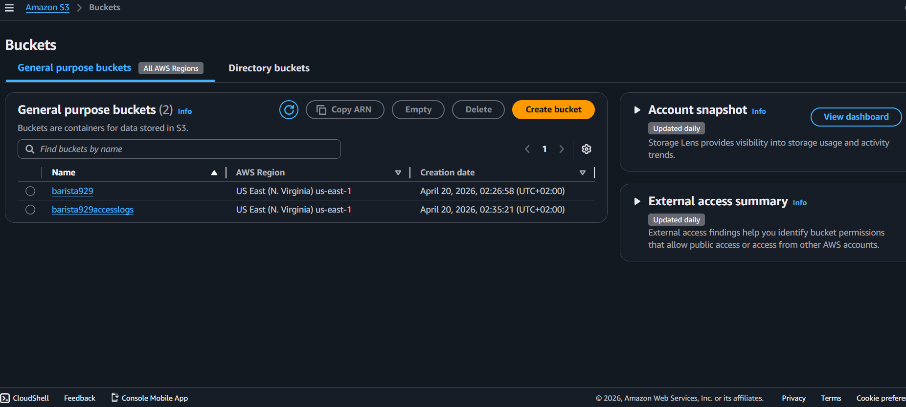
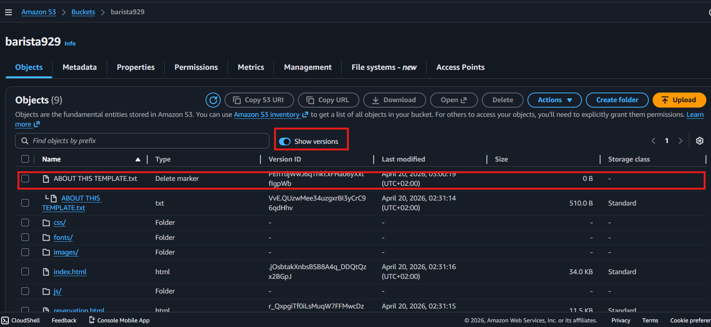

# AWS S3 Static Website Hosting Project

## Project Overview
This project demonstrates how to host a static website using Amazon S3 while implementing logging and versioning best practices.

The project includes:
- Static Website Hosting
- S3 Versioning
- Access Logging
- Public Access Configuration
- Cost & Recovery Considerations

---

## Technologies Used
- AWS S3
- HTML
- CSS
- JavaScript

---

## Project Features
- Hosted a static website using Amazon S3
- Configured index.html and error.html
- Enabled public access permissions
- Configured server access logging
- Enabled bucket versioning
- Tested file recovery and object version control

---

## What I Learned
- How S3 static hosting works
- Managing public access securely
- Benefits and risks of S3 Versioning
- Importance of lifecycle and cost management
- Logging and monitoring basics in AWS

---

## Screenshots

### S3 Bucket Configuration

### Live Website

### Versioning Enabled

---

## Key Takeaway
Always design cloud environments with both recovery and cost optimization in mind.

S3 Versioning is powerful for backup and recovery, but storage usage can grow quickly without lifecycle management policies.
